# JobLens — Complete System Architecture

```mermaid
flowchart TD

    %% ─────────────────────────────────────────
    %% USER / BROWSER
    %% ─────────────────────────────────────────
    subgraph Browser["🖥️  Browser"]
        direction TB
        subgraph Pages["Pages (Next.js App Router)"]
            P1["/ Tracker\nKanban Board · Drag & Drop"]
            P2["/dashboard\nStats · Charts · Insights"]
            P3["/war-room\nOffer Compare · Negotiation"]
            P4["/interview-logger\nRounds · Q&A · Confidence"]
            P5["/jd-analyzer\nJD Parser · Fit Score"]
            P6["/offer-analyzer\nClause Risk · PDF Upload"]
            P7["/profile\nUser Profile · Target Role"]
            P8["/login\nCognito Hosted UI Redirect"]
        end

        subgraph Contexts["React Context Providers"]
            C1["SessionProvider\n(NextAuth)"]
            C2["CurrencyProvider\n(display currency)"]
            C3["ColumnsProvider\n(kanban columns)"]
        end

        subgraph UIComponents["Key UI Components"]
            UC1["KanbanBoard\n+ StageSection\n+ DndContext"]
            UC2["JobCard\n(draggable · edit · expand)"]
            UC3["OutreachModal\nCold Email · LinkedIn DM"]
            UC4["AddCardModal"]
            UC5["ColumnEditorModal"]
            UC6["AppSidebar\n(nav · currency · user)"]
            UC7["Dashboard Charts\n(Recharts — bar · line · funnel)"]
            UC8["InsightCard · StatCards\nApplicationFunnel"]
        end
    end

    %% ─────────────────────────────────────────
    %% VERCEL EDGE / SERVERLESS
    %% ─────────────────────────────────────────
    subgraph Vercel["⚡  Vercel — Edge + Serverless Functions"]
        direction TB

        NA["NextAuth.js\nJWT · CognitoProvider\n/api/auth/[...nextauth]"]

        subgraph CoreRoutes["Core Data API Routes"]
            R1["/api/applications\nGET list · POST create"]
            R2["/api/applications/[id]\nPATCH update · DELETE"]
            R3["/api/columns\nGET · POST · PATCH · DELETE\n/bulk reorder"]
            R4["/api/profile\nGET · PATCH"]
            R5["/api/offers\nGET · POST · DELETE"]
            R6["/api/interviews\nGET · POST · PATCH · DELETE"]
            R7["/api/interviews/questions\nGET · POST · PATCH"]
            R8["/api/follow-ups\nGET · POST"]
            R9["/api/dashboard\nGET — analytics + health score\n/rejection-patterns"]
            R10["/api/extract-pdf\nPOST — parse PDF text"]
        end

        subgraph AIRoutes["AI API Routes  →  AWS Bedrock"]
            A1["/api/analyze-jd\ntech stack · fit score\nskill gap · red flags\nseniority signals"]
            A2["/api/analyze-offer\nclause risk (🟢🟡🔴)\nredline suggestions\ncomp summary"]
            A3["/api/applications/[id]/outreach\ncold email subject+body\nLinkedIn DM"]
            A4["/api/applications/[id]/followup-draft\nfollow-up email draft\nsaved to follow_ups"]
            A5["/api/war-room-insights\noffer comparison table\nnegotiation tips"]
            A6["/api/interviews/[id]/confidence\nconfidence score 0-100\nround analysis"]
        end
    end

    %% ─────────────────────────────────────────
    %% AWS
    %% ─────────────────────────────────────────
    subgraph AWS["☁️  Amazon Web Services  (us-east-1)"]
        direction TB

        subgraph CognitoBox["AWS Cognito"]
            COG["User Pool\nHosted UI Login\nOAuth2 / OIDC\nid_token · access_token"]
        end

        subgraph BedrockBox["AWS Bedrock"]
            BED["amazon.nova-pro-v1:0\n(Amazon Nova Pro)\nInvokeModel API"]
        end

        subgraph AuroraBox["Aurora PostgreSQL  (Drizzle ORM · SSL)"]
            direction LR
            subgraph CoreTables["Core Tables"]
                T1["users\ncognito_sub · email · name\nheadline · target_role\ntarget_salary_min/max"]
                T2["applications\ncompany · role · level\nstatus · salary · notes\njob_url · job_description"]
                T3["kanban_columns\ncolumn_key · title · position\nis_rejected · is_offer_stage\nis_interview_eligible"]
            end
            subgraph InterviewTables["Interview Tables"]
                T4["interview_rounds\nround_type · outcome\nconfidence_score\nconfidence_reason"]
                T5["interview_questions\nquestion · topic_tag\nwhat_i_said · ai_answer\nrating · ai_rating_reason"]
            end
            subgraph OfferTables["Offer Tables"]
                T6["offer_letters\nbase_salary · equity\nsigning_bonus · vesting\ns3_key · start_date"]
                T7["offer_clauses\nclause_type · risk_level\nplain_english\nredline_suggestion"]
                T8["negotiation_logs\nask_amount · counter_amount\noutcome · notes"]
            end
            subgraph AuxTables["Auxiliary Tables"]
                T9["jd_extractions\ntech_stack[] · fit_score\nrequired_skills[]\nred_flags[]"]
                T10["contacts\nname · title · company\nlinkedin_url · email"]
                T11["follow_ups\nsubject · body · due_at\nsent_at"]
                T12["resume_versions\nversion_name · s3_key\nrole_type"]
            end
        end

        S3["Amazon S3\nOffer Letter PDFs\nResume Versions"]
    end

    %% ─────────────────────────────────────────
    %% CONNECTIONS — Auth
    %% ─────────────────────────────────────────
    P8 -->|"OAuth2 redirect"| COG
    COG -->|"callback + id_token"| NA
    NA -->|"signIn: upsert user row"| T1
    NA -->|"JWT session cookie"| C1

    %% ─────────────────────────────────────────
    %% CONNECTIONS — Pages → API
    %% ─────────────────────────────────────────
    P1 --> R1 & R2 & R3
    P2 --> R9
    P3 --> R5 & A5
    P4 --> R6 & R7 & A6
    P5 --> A1
    P6 --> R10 & A2 & R5
    P7 --> R4

    %% ─────────────────────────────────────────
    %% CONNECTIONS — Components → API
    %% ─────────────────────────────────────────
    UC3 --> A3
    UC8 --> A4

    %% ─────────────────────────────────────────
    %% CONNECTIONS — API → DB
    %% ─────────────────────────────────────────
    R1 & R2 --> T2
    R3 --> T3
    R4 --> T1
    R5 --> T6 & T7
    R6 --> T4
    R7 --> T5
    R8 --> T11
    R9 --> T2 & T4 & T11
    A1 --> T9 & T2
    A2 --> T7 & T6
    A4 --> T11
    A6 --> T4

    %% ─────────────────────────────────────────
    %% CONNECTIONS — AI Routes → Bedrock
    %% ─────────────────────────────────────────
    A1 & A2 & A3 & A4 & A5 & A6 --> BED

    %% ─────────────────────────────────────────
    %% CONNECTIONS — PDF / Storage
    %% ─────────────────────────────────────────
    R10 -->|"parse PDF"| S3
    A2 -->|"offer letter"| S3
    R4 -->|"resume upload"| S3

    %% ─────────────────────────────────────────
    %% DB FOREIGN KEYS
    %% ─────────────────────────────────────────
    T1 --> T2 & T3 & T10 & T12
    T2 --> T4 & T6 & T9 & T10 & T11
    T4 --> T5
    T6 --> T7 & T8
    T10 --> T11

    %% ─────────────────────────────────────────
    %% STYLES
    %% ─────────────────────────────────────────
    classDef page        fill:#1a1a2e,stroke:#4f8ef7,color:#c9d1d9
    classDef context     fill:#0d2137,stroke:#3a7bd5,color:#8ab4f8
    classDef component   fill:#0d1f0d,stroke:#3a9d3a,color:#90e090
    classDef route       fill:#1a1008,stroke:#c68b1a,color:#ffd580
    classDef airoute     fill:#1a0d1a,stroke:#9b4dca,color:#d9a5f5
    classDef table       fill:#0d1a0d,stroke:#2ea043,color:#7ee787
    classDef awsservice  fill:#1a0d00,stroke:#ff9900,color:#ffb84d
    classDef vercel      fill:#111,stroke:#ffffff44,color:#ccc

    class P1,P2,P3,P4,P5,P6,P7,P8 page
    class C1,C2,C3 context
    class UC1,UC2,UC3,UC4,UC5,UC6,UC7,UC8 component
    class R1,R2,R3,R4,R5,R6,R7,R8,R9,R10,NA route
    class A1,A2,A3,A4,A5,A6 airoute
    class T1,T2,T3,T4,T5,T6,T7,T8,T9,T10,T11,T12 table
    class COG,BED,S3 awsservice
```



---

### How to render

**GitHub/GitLab** — push and view the file. Mermaid renders natively.

**VS Code** — install `bierner.markdown-mermaid`, then `Cmd+Shift+V`.

**Export PNG:**
```bash
npm install -g @mermaid-js/mermaid-cli
node docs/render-diagrams.js
```

**Mermaid Live Editor** — paste the diagram block at [mermaid.live](https://mermaid.live)
