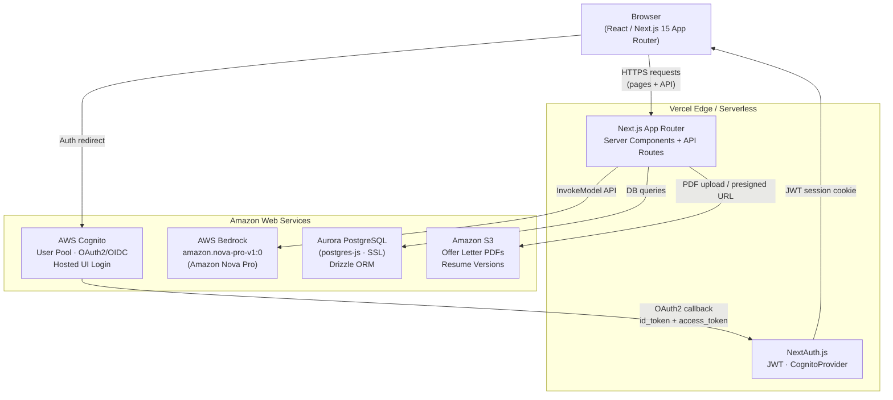
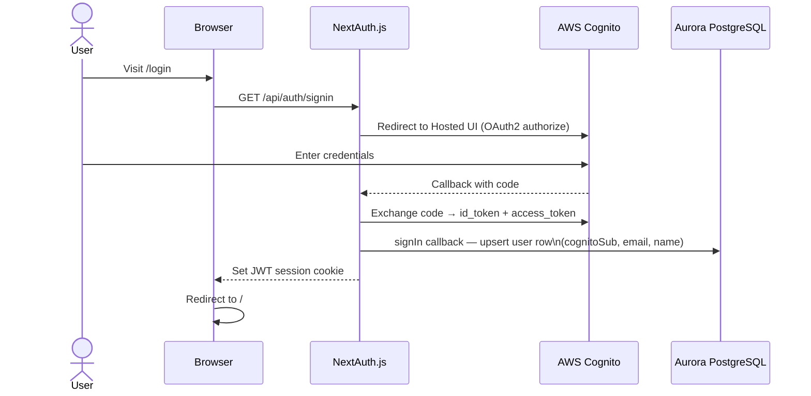
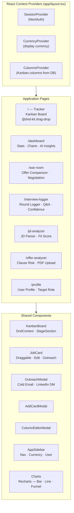
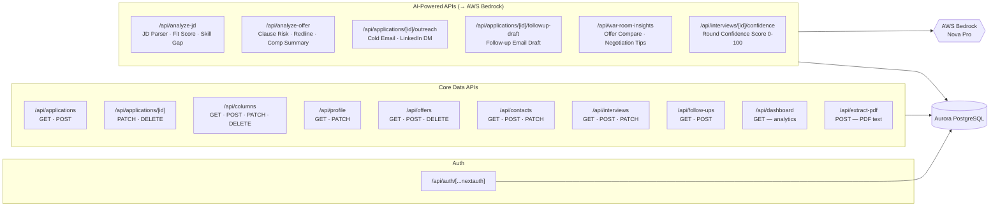
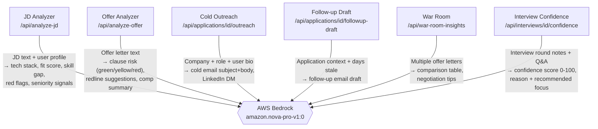
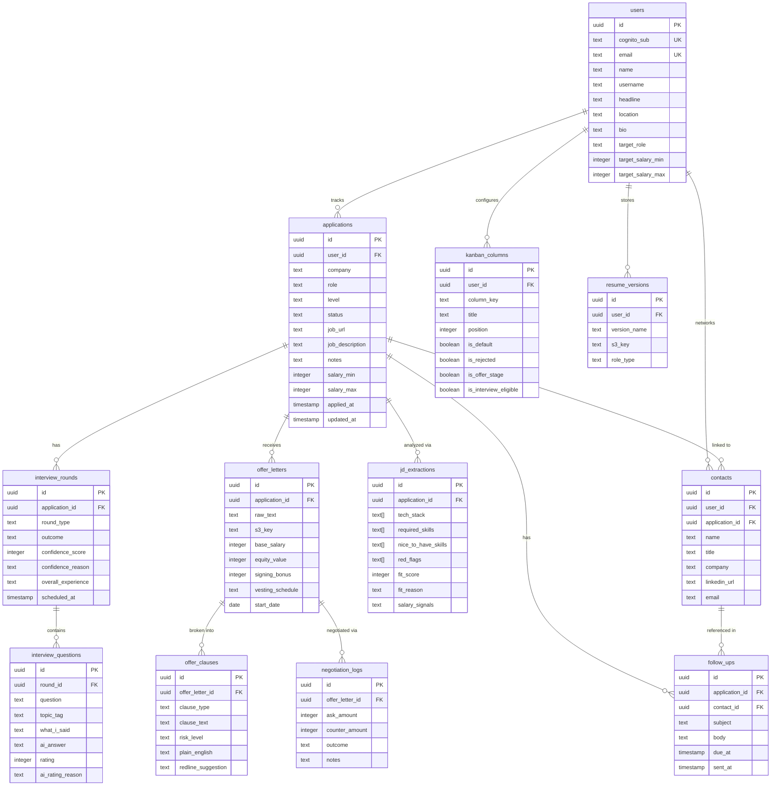
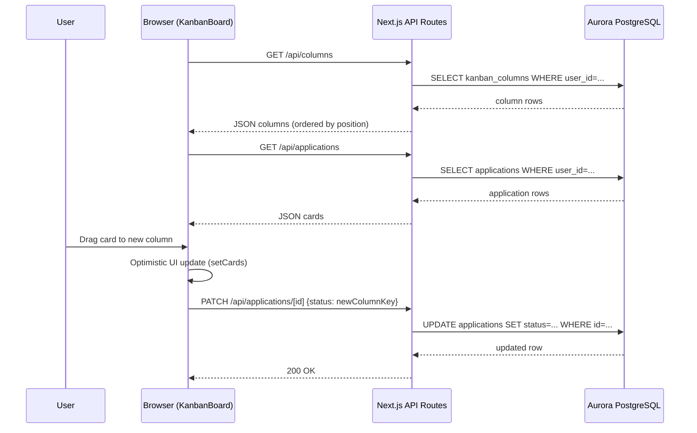
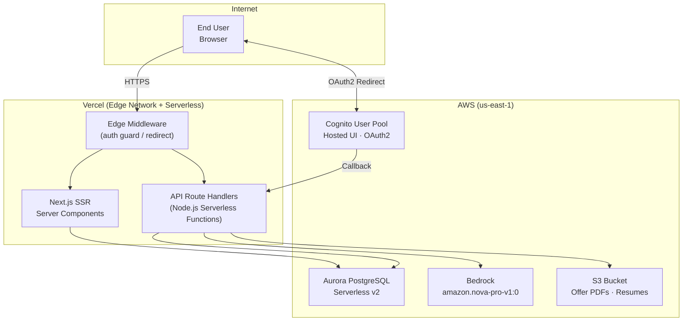

# JobLens — System Architecture

## Overview

JobLens is a full-stack AI-powered job-search tracker built on Next.js 15 (App Router), deployed on Vercel, with AWS as the cloud backend. Every AI feature calls Amazon Bedrock (Nova Pro). Identity is handled entirely by AWS Cognito via OAuth2/OIDC, bridged to the app through NextAuth.js. Data lives in an Aurora PostgreSQL database accessed through Drizzle ORM.

---

## 1. High-Level System Flow



---

## 2. Authentication Flow



---

## 3. Frontend Architecture



---

## 4. API Routes & Backend Logic



---

## 5. AI Features Detail



---

## 6. Database Schema (Entity-Relationship)



---

## 7. Data Flow — Kanban Board



---

## 8. Deployment Architecture



---

## Rendering the Diagrams

### Option 1 — GitHub / GitLab (zero setup)
Push this file. Both GitHub and GitLab render Mermaid fenced code blocks natively in Markdown previews.

### Option 2 — VS Code
Install the **Mermaid Preview** extension (`bierner.markdown-mermaid`), then open this file and use `Ctrl+Shift+V` / `Cmd+Shift+V`.

### Option 3 — Mermaid CLI (PNG/SVG export)

```bash
# Install
npm install -g @mermaid-js/mermaid-cli

# Export a single diagram (extract the mermaid block to a .mmd file first)
mmdc -i diagram.mmd -o architecture.png -t dark -b transparent

# Or use the helper script below
node docs/render-diagrams.js
```

### Option 4 — Mermaid Live Editor
Paste any diagram block at [mermaid.live](https://mermaid.live) for instant preview and PNG/SVG export.

---

## Tech Stack Summary

| Layer | Technology |
|---|---|
| Framework | Next.js 15 (App Router, Turbopack) |
| Language | TypeScript |
| Styling | Tailwind CSS v4 (OKLCH color tokens) |
| Drag & Drop | @dnd-kit/core |
| Charts | Recharts |
| Auth | NextAuth.js + AWS Cognito (OAuth2/OIDC) |
| ORM | Drizzle ORM |
| Database | Aurora PostgreSQL (postgres-js, SSL) |
| AI | AWS Bedrock — amazon.nova-pro-v1:0 (Nova Pro) |
| Storage | Amazon S3 (PDFs, resumes) |
| Deployment | Vercel (Edge + Serverless) |
